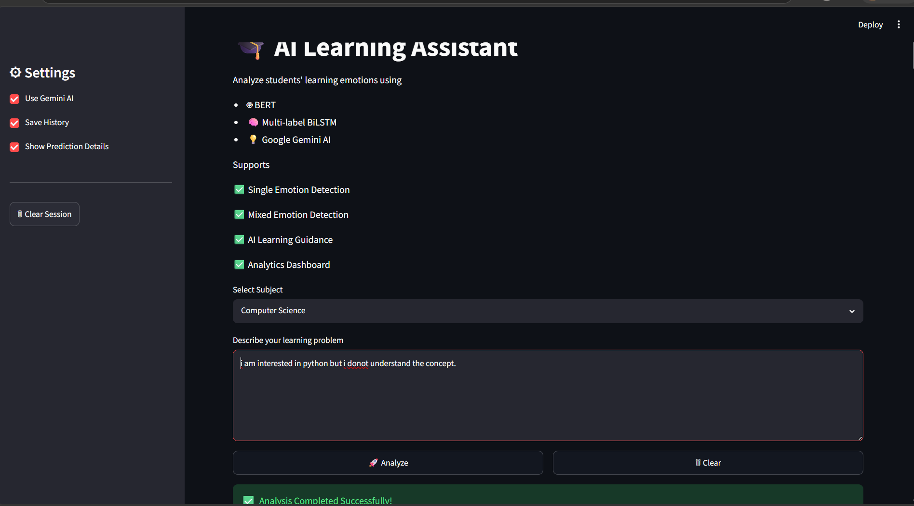
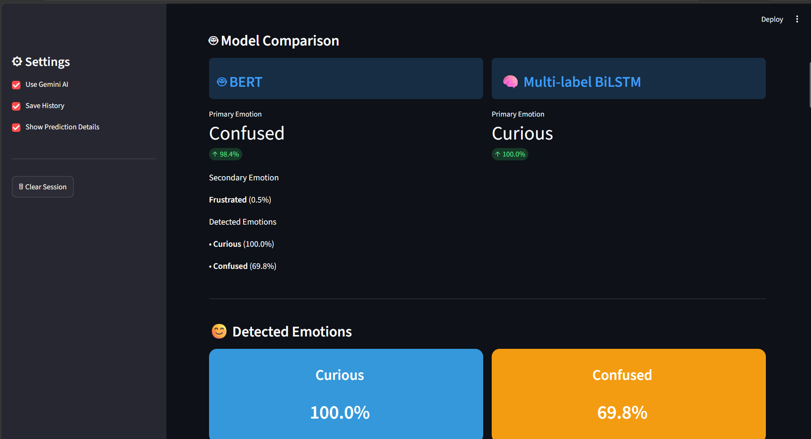
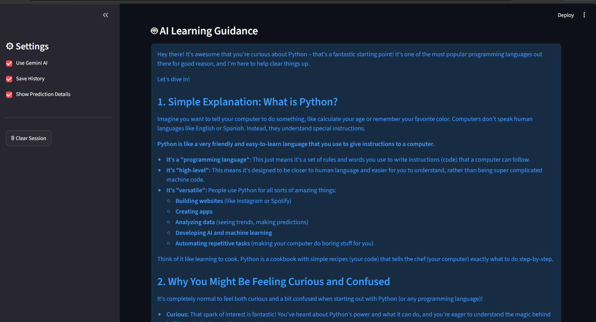
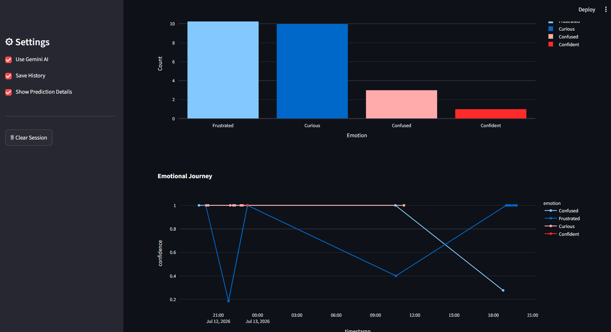

# 🎓 Emotion Detection and Learning Support Engine

An AI-powered web application that detects students' learning emotions from textual input and provides personalized learning support using **BERT**, **Multi-label BiLSTM**, **Rule-based Emotion Enhancement**, and **Google Gemini AI**.

---

## 📖 Project Overview

The **Emotion Detection and Learning Support Engine** is an intelligent learning support platform designed to understand students' emotions while studying. By analyzing text entered by students, the system predicts one or multiple emotions and generates personalized AI-powered learning guidance to improve the overall learning experience.

The project combines **Natural Language Processing (NLP)**, **Deep Learning**, and **Generative AI** to create an interactive educational assistant.

---

## ✨ Key Features

- 🤖 BERT-based Emotion Classification
- 🧠 Multi-label BiLSTM Emotion Detection
- 💡 Personalized Learning Guidance using Google Gemini AI
- 📊 Interactive Emotion Analytics Dashboard
- 📚 Subject-wise Emotion Analysis
- 😊 Multi-emotion Detection
- 📈 Emotion Confidence Scores
- 📝 Prediction History Logging
- 📥 Download AI Responses
- 🎨 User-friendly Streamlit Interface

---

## 😊 Supported Emotions

- Curious
- Confused
- Frustrated
- Confident
- Bored

---

# 🏗️ System Architecture

```
Student Input
      │
      ▼
Text Preprocessing
      │
      ▼
BERT Emotion Detection
      │
      ▼
Multi-label BiLSTM Prediction
      │
      ▼
Rule-based Emotion Enhancement
      │
      ▼
Emotion Analysis
      │
      ▼
Google Gemini AI
      │
      ▼
Personalized Learning Support
      │
      ▼
Analytics Dashboard
```

---

# 📂 Project Structure

```
Emotion_Detection_and_Learning_Support_Engine/

│── app.py
│── requirements.txt
│── README.md
│── .gitignore
│
├── datasets/
├── docs/
├── history/
├── screenshots/
├── training/
└── utils/
```

> **Note:** Trained BERT and BiLSTM model files are not included due to GitHub file size limitations.

---

# 🛠️ Technologies Used

- Python
- Streamlit
- TensorFlow
- Keras
- Hugging Face Transformers
- Google Gemini API
- Pandas
- NumPy
- Plotly
- Scikit-learn

---

# 🚀 Installation

### Clone the repository

```bash
git clone https://github.com/DURGAGANGADHAR18/Emotion-Detection-Learning-Support-Engine.git
```

### Navigate to the project

```bash
cd Emotion-Detection-Learning-Support-Engine
```

### Install dependencies

```bash
pip install -r requirements.txt
```

### Run the application

```bash
streamlit run app.py
```

---

# 🔑 Google Gemini API Setup

1. Generate a free API key from Google AI Studio.

https://aistudio.google.com/app/apikey

2. Configure your API key before running the application.

Example:

```python
genai.configure(api_key="YOUR_API_KEY")
```

> **Important:** Never upload your API key to GitHub.

---

# 🤖 AI Models Used

## BERT

- Transformer-based emotion classification
- Predicts primary and secondary emotions
- Fine-tuned for educational emotion analysis

---

## Multi-label BiLSTM

Architecture

- Embedding Layer
- Bidirectional LSTM
- Dropout Layer
- Dense Layer
- Sigmoid Output Layer

Supports simultaneous detection of multiple emotions from a single student response.

---

# 📊 Dashboard Features

The analytics dashboard provides:

- Emotion Distribution
- Emotion Confidence Scores
- Session History
- Student Emotion Trends
- Interactive Charts

---

# 🧪 Sample Inputs

### Example 1

**Input**

```
I enjoy programming and I am curious to learn more, but debugging my code is confusing and frustrating.
```

**Expected Emotions**

- Frustrated
- Curious
- Confused

---

### Example 2

**Input**

```
I understand Java concepts well and can solve programming problems confidently.
```

**Expected Emotion**

- Confident

---

### Example 3

**Input**

```
I feel bored while studying theory subjects.
```

**Expected Emotion**

- Bored

---

# 📸 Screenshots

## 🏠 Home Page



---

## 🤖 Emotion Prediction



---

## 💡 AI Learning Guidance



---

## 📊 Emotion Distribution


---

## 📈 Session History


---

## 📉 Emotion Representation



---

# 📄 Application Output

The application provides:

- Primary Emotion
- Secondary Emotion
- Multiple Emotion Detection
- Emotion Confidence Scores
- Personalized AI Learning Guidance
- Session History
- Analytics Dashboard

---

# 🔮 Future Enhancements

- 🎤 Voice Emotion Detection
- 😀 Facial Emotion Recognition
- 📈 Student Progress Tracking
- 🎯 Adaptive Learning Recommendations
- ☁️ Cloud Deployment
- 📱 Mobile Application
- 🌍 Multi-language Support

---

# 👨‍💻 Developer

**Bogadula Durga Gangadhar Rao**

B.Tech – Computer Science and Engineering

Seshadri Rao Gudlavalleru Engineering College (SRGEC)

GitHub:
https://github.com/DURGAGANGADHAR18

---

# 📜 License

This project is developed for educational and academic purposes.

---

# ⭐ Support

If you found this project useful, please consider giving this repository a ⭐ on GitHub.

Your support is greatly appreciated!
